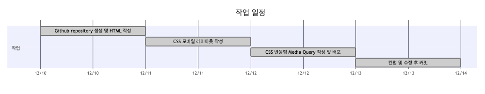
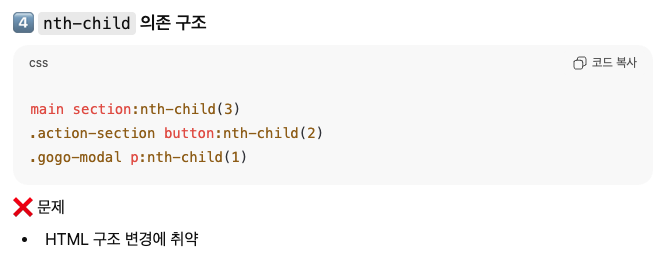

# 1만시간의 법칙

일만시간의 법칙 반응형 페이지 구현

## 동기

1. 코드를 어떻게 작성했는지 나눌 수 있는 좋은 기회
2. 상품

## 구현 과정

## 개발 범위

1. HTML5, CSS 기반 정적 웹 페이지 구현

## 구현 포인트

### 시멘틱 마크업

1. 의미있는 시맨틱 태그 `section` `aside` `footer` 를 선택

### 웹 접근성 고려

1. heading 태그의 올바른 활용 - `class=a11y-hidden` 작성

### 모바일 퍼스트 레이아웃 구성

1. 타이포그래피, container width 등을 단계적으로 설계

### Media Query를 활용한 반응형 웹 구현

1. 모바일 화면, 가로형 태블릿 화면, 데스크탑 세단계의 media query 적용

### 디자인 시안 기반의 웹 페이지 구현

### CSS 변수 (:root) 활용

1. 유지보수와 일관성에 유용한 개발

### CSS 클래스 네이밍 : 케밥 케이스(kebab-case) 적용

1. 통일감 있는 클래스 작성법으로 혼란을 줄입

## 개선할 점

## 느낀점 (수확)

1. 시멘틱 마크업에 따른 구조적인 코드 작성을 배웠습니다.
   - `heading` 태그의 사용법
   - `section` `article` `aside` 등 사용
2. 디자이너와의 협업을 간접적으로나마 경험
3. 디자이너 & 프론트엔드 개발자가 개인적인 목표 - 디자인부터 구조적이어야 웹 구현에 용이하다는 점 깨달음
