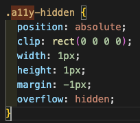

# 1만시간의 법칙

## 1. 프로젝트 소개

일만시간의 법칙 반응형 페이지 구현

### 1.1 목표

"일만시간의 법칙" 피그마 디자인을 기반으로 HTML과 CSS로 정적 반응형 웹페이지를 구현합니다.

- 디자인 시안을 기반의 정적 웹 페이지 구현
- 시맨틱 마크업과 접근성을 고려한 구조 설계

### 1.2 개발 범위

- HTML5, CSS 기반 정적 웹 페이지 구현

## 2. 개발 환경

### 2.1 개발 환경

#### 기술 스택

- HTML5: 시맨틱 마크업
- CSS3: flexbox, @media
- Git & GitHub: 버전 관리

## 3. 구현 과정

### 3.1 팀 구성

팀원/summary>

| 이름   | 역할                      |
| ------ | ------------------------- |
| 한유리 | HTML/CSS 퍼블리싱 \* 배포 |

### 3.2 작업 일정

## 4.구현 포인트

### 4.1시멘틱 마크업

- 의미있는 시맨틱 태그 `section` `aside` `footer` 를 선택

### 4.2 웹 접근성 SEO 고려

- heading 태그의 올바른 활용 - `class=a11y-hidden` 작성
  

### 4.3 모바일 퍼스트 레이아웃 구성

- 타이포그래피, container width 등을 단계적으로 설계

### 4.4 Media Query를 활용한 반응형 웹 구현

- 모바일 화면, 가로형 태블릿 화면, 데스크탑 세단계의 media query 적용

### 4.5 CSS 변수 (:root) 활용

- 유지보수와 일관성에 유용한 개발

### 4.6 CSS 클래스 네이밍 : 케밥 케이스(kebab-case) 적용

- 통일감 있는 클래스 작성법으로 혼란을 줄입

## 개선할 점

## 5. 발표 동기

코드를 어떻게 작성했는지 나눌 수 있는 좋은 기회

## 6. 느낀점 (수확)

1. 시멘틱 마크업에 따른 구조적인 코드 작성을 배웠습니다.
   - `heading` 태그의 사용법
   - `section` `article` `aside` 등 사용
2. 디자이너와의 협업을 간접적으로나마 경험
3. 디자이너 & 프론트엔드 개발자가 개인적인 목표 - 디자인부터 구조적이어야 웹 구현에 용이하다는 점 깨달음
